<div align="center">
  
  <h3>내 곁에 따듯한 코딩 선생님, 코드팜</h3>
  <h4>학생들을 위한 실시간 <b>AI 문제 풀이 코칭 서비스</b>입니다.</h4>
</div>

<br/>

- **개발 기간** : 2026.01.06 ~ 2026.02.13 **(3주)**
- **플랫폼** : Web
- **개발 인원** : 6명
- **기관** : 삼성 청년 SW · AI 아카데미 14기

<br/>

<div align="center">
  
</div>

---

## 🔎 목차

<div align="center">

- [🙌 팀원 구성](#-팀원-구성)
- [🪄 기술 스택](#-기술-스택)
- [🛠️ 아키텍처](#-아키텍처)
- [📲 기능 구성](#-기능-구성)
- [📂 디렉터리 구조](#-디렉터리-구조)
- [📦 프로젝트 산출물](#-프로젝트-산출물)
- [🖼️ 화면 설계서](#-화면-설계서)
- [🗄️ ERD](#-ERD)
- [🗓️ Jira Issues](#-Jira-Issues)

</div>

---

## 🙌 팀원 구성

<table align="center">
  <tr>
    <td align="center">
      
      <br/>
      <ul>
        <li>... 구현</li>
        <li>... 구현</li>
      </ul>
    </td>
    <td align="center">
      
      <br/>
      <ul>
        <li>... 구현</li>
        <li>... 구현</li>
      </ul>
    </td>
    <td align="center">
      
      <br/>
      <ul>
        <li>... 구현</li>
        <li>... 구현</li>
      </ul>
    </td>
  </tr>

  <tr>
    <td align="center">
      
      <br/>
      <ul>
        <li>... 구현</li>
        <li>... 구현</li>
      </ul>
    </td>
    <td align="center">
      
      <br/>
      <ul>
        <li>... 구현</li>
        <li>... 구현</li>
      </ul>
    </td>
    <td align="center">
      
      <br/>
      <ul>
        <li>... 구현</li>
        <li>... 구현</li>
      </ul>
    </td>
  </tr>
</table>

---

## 🪄 기술 스택

<div align="center">

### 🫡 Frontend


### 🤓 Backend


### 🧐 AI / Data


### 🥱 DevOps


<table>
  <tr>
    <th>Category</th>
    <th>Specification</th>
  </tr>
  <tr>
    <td><b>Instance Type</b></td>
    <td>AWS EC2 t2.xlarge</td>
  </tr>
  <tr>
    <td><b>CPU</b></td>
    <td>4 vCPUs</td>
  </tr>
  <tr>
    <td><b>RAM</b></td>
    <td>16 GB</td>
  </tr>
  <tr>
    <td><b>Storage</b></td>
    <td>SSD 320 GB</td>
  </tr>
  <tr>
    <td><b>Docker</b></td>
    <td>29.1.5</td>
  </tr>
  <tr>
    <td><b>Docker Compose</b></td>
    <td>v2.25.0</td>
  </tr>
  <tr>
    <td><b>CI/CD</b></td>
    <td>GitLab CI/CD</td>
  </tr>
  <tr>
    <td><b>CI Runner</b></td>
    <td>Self-hosted GitLab Runner (Docker executor)</td>
  </tr>
  <tr>
    <td><b>Nginx</b></td>
    <td>nginx/1.29.5</td>
  </tr>
  <tr>
    <td><b>K6</b></td>
    <td>v1.5.0</td>
  </tr>
  <tr>
    <td><b>Prometheus</b></td>
    <td>3.9.1</td>
  </tr>
  <tr>
    <td><b>Grafana</b></td>
    <td>12.3.2</td>
  </tr>
  <tr>
    <td><b>Webhook Handler</b></td>
    <td>Python 3.11-slim, FastAPI 0.128.0, Uvicorn[standard] 0.40.0</td>
  </tr>
</table>


### 😀 Collaboration


</div>

## 🛠️ 아키텍처
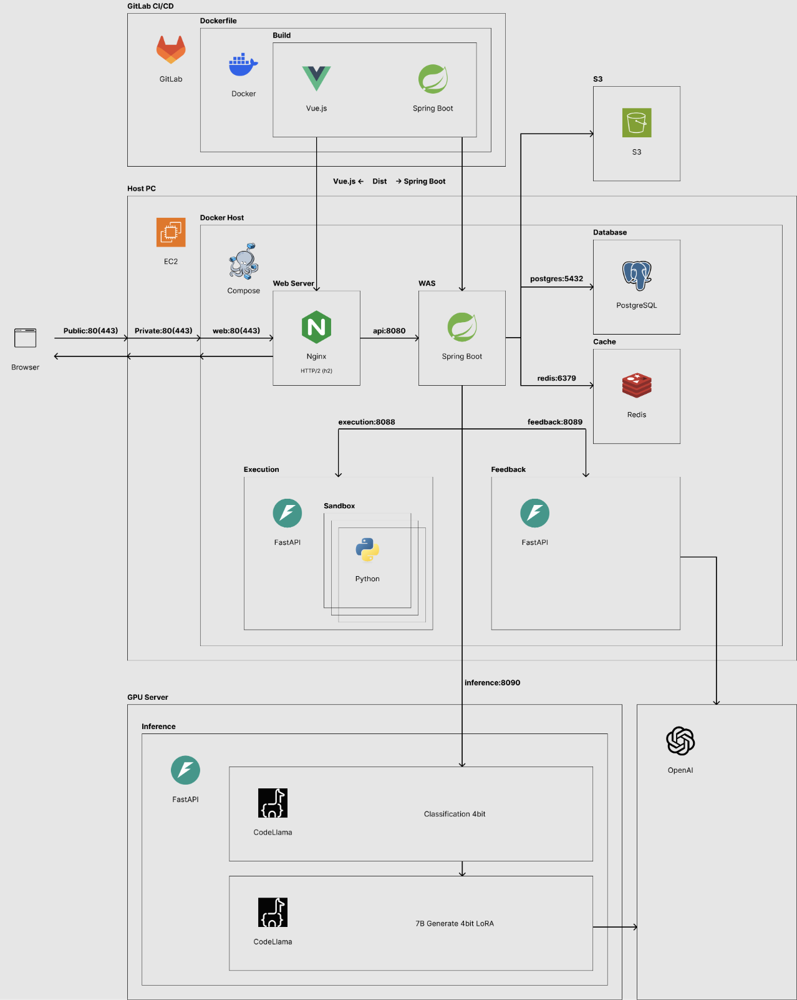

## 📲 기능 구성

<div align="center">

| 모든 문제 | 커리큘럼 |
| :---: | :---: |
| 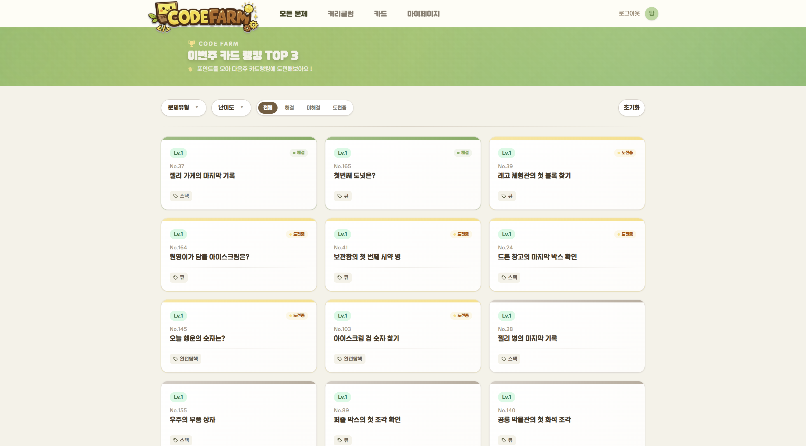 | 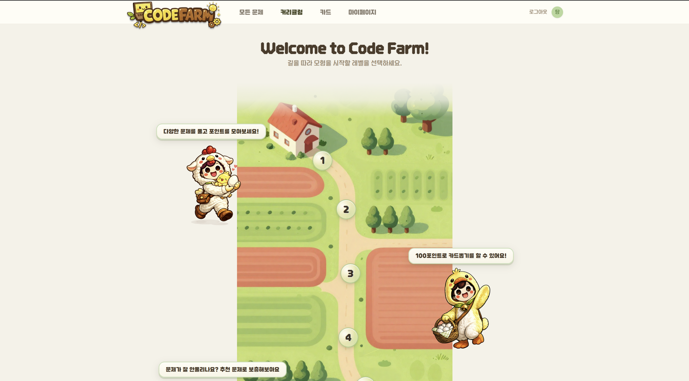 |

| 로드맵 | 카드 |
| :---: | :---: |
| 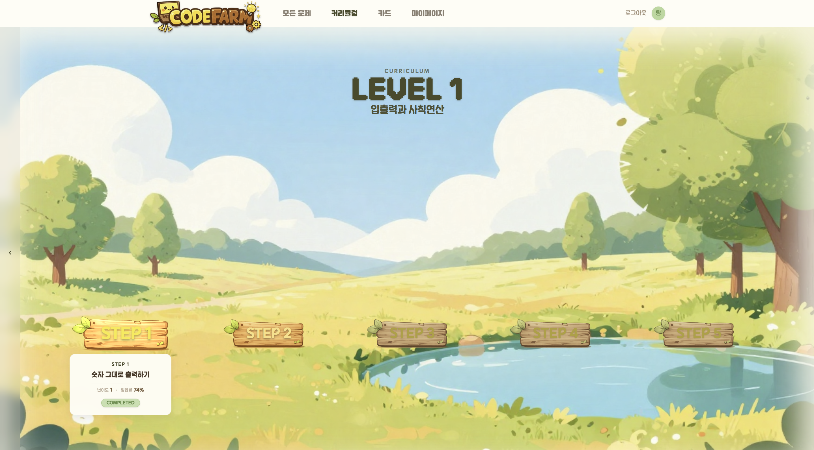 | 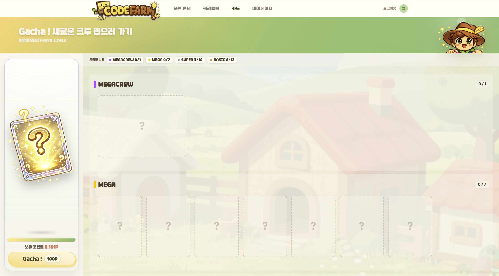 |

| 마이페이지(내정보) | 마이페이지(학습기록) |
| :---: | :---: |
| 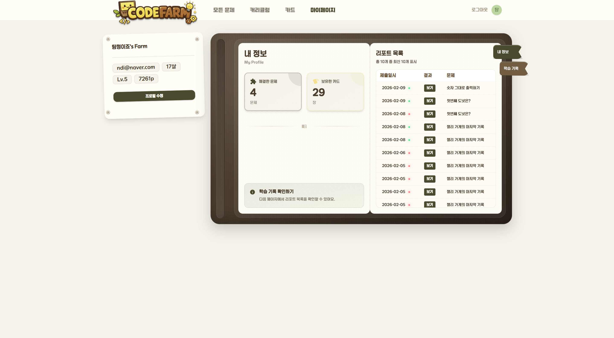 | 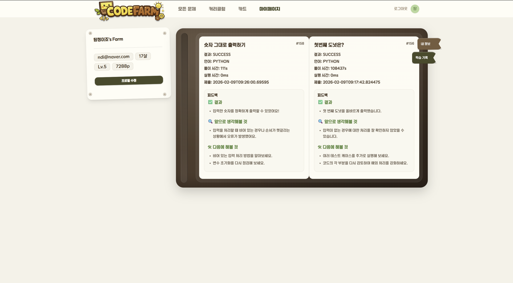 |

| IDE | 실행하기 |
| :---: | :---: |
| 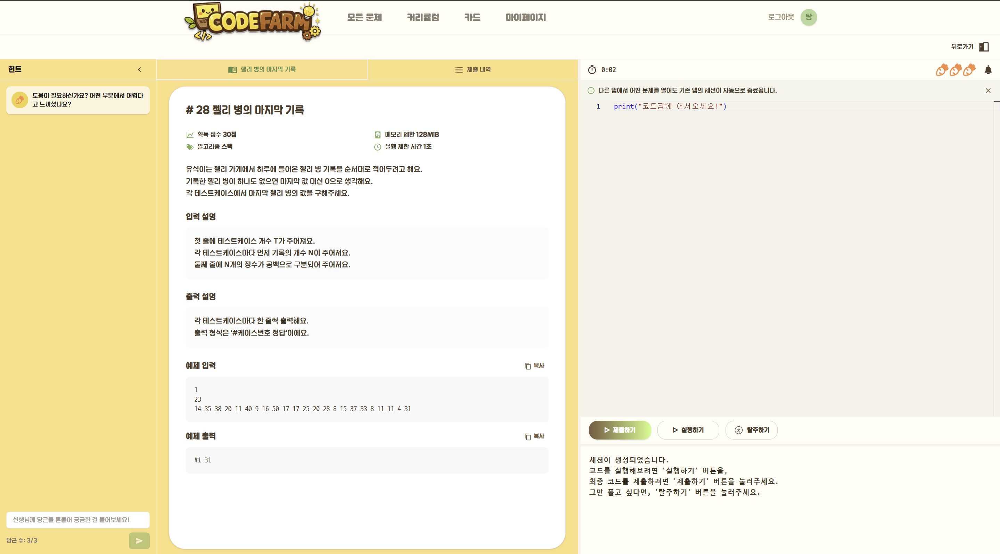 | 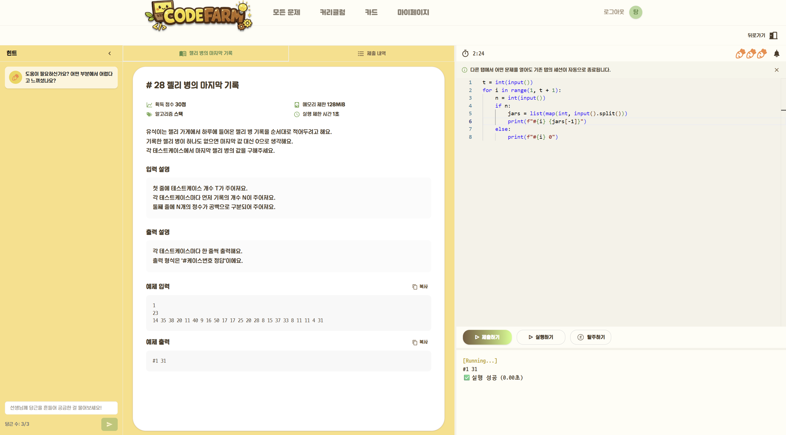 |

| 힌트 | 피드백 |
| :---: | :---: |
| 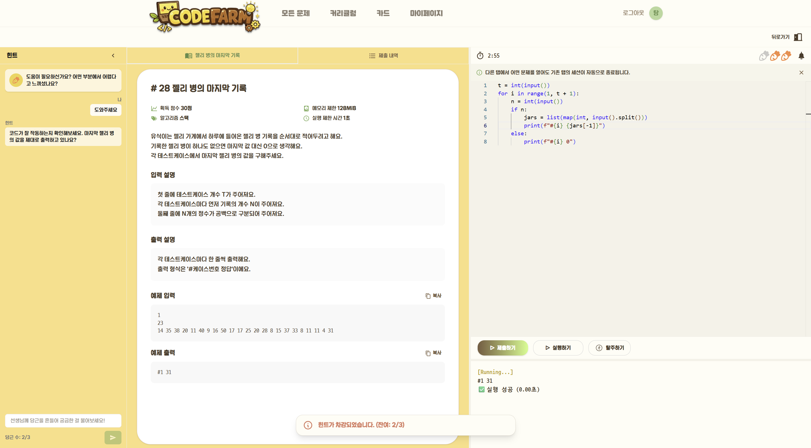 | 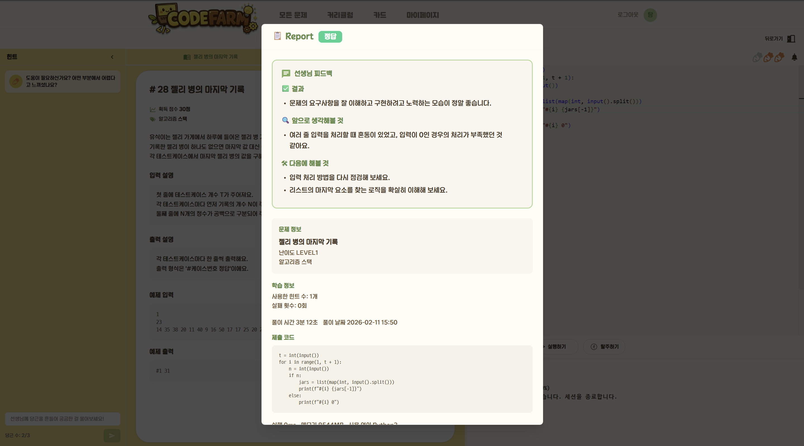 |

</div>

## 📂 디렉터리 구조

### GitLab Repository
<details>
  <summary>
    assets
  </summary>
  
  ```
  ./assets
  |-- architecture.png
  |-- cards.png
  |-- choi_yeonjae.jpg
  |-- curriculums.png
  |-- execution.png
  |-- feedback.png
  |-- hints.png
  |-- homepage.png
  |-- ide.png
  |-- jeong_mungi.jpg
  |-- kim_hyeongtaek.jpg
  |-- kim_minkyung.jpg
  |-- logo.png
  |-- mypage_info.png
  |-- mypage_record.png
  |-- nam_woosung.jpg
  |-- park_seoyeon.jpg
  |-- problems.png
  `-- roadmap.png
  ```

</details>
<details>
  <summary>
    backend
  </summary>

  ```
  ./backend
  |-- .dockerignore
  |-- .gitattributes
  |-- .gitignore
  |-- .gradle
  |   |-- 8.14.3
  |   |   |-- checksums
  |   |   |   |-- checksums.lock
  |   |   |   `-- sha1-checksums.bin
  |   |   |-- expanded
  |   |   |-- fileChanges
  |   |   |   `-- last-build.bin
  |   |   |-- fileHashes
  |   |   |   |-- fileHashes.bin
  |   |   |   `-- fileHashes.lock
  |   |   |-- gc.properties
  |   |   `-- vcsMetadata
  |   |-- buildOutputCleanup
  |   |   |-- buildOutputCleanup.lock
  |   |   `-- cache.properties
  |   `-- vcs-1
  |       `-- gc.properties
  |-- Dockerfile
  |-- build
  |   |-- classes
  |   |   `-- java
  |   |       |-- main
  |   |       `-- test
  |   |-- reports
  |   |   `-- problems
  |   |       `-- problems-report.html
  |   `-- resources
  |       |-- main
  |       `-- test
  |-- build.gradle
  |-- config
  |   `-- checkstyle
  |       `-- checkstyle.xml
  |-- gradle
  |   `-- wrapper
  |       |-- gradle-wrapper.jar
  |       `-- gradle-wrapper.properties
  |-- gradlew
  |-- gradlew.bat
  |-- settings.gradle
  `-- src
      |-- main
      |   |-- java
      |   |   `-- com
      |   |       `-- ssafy
      |   |           `-- codefarm
      |   |               |-- CodefarmApplication.java
      |   |               |-- card
      |   |               |   |-- controller
      |   |               |   |   `-- CardController.java
      |   |               |   |-- dto
      |   |               |   |   |-- query
      |   |               |   |   |   |-- CardDetailQueryDto.java
      |   |               |   |   |   `-- MyCardQueryDto.java
      |   |               |   |   `-- response
      |   |               |   |       |-- AllCollectionMasterDto.java
      |   |               |   |       |-- CardDetailResponseDto.java
      |   |               |   |       |-- CardRankingResponseDto.java
      |   |               |   |       |-- CardResponseDto.java
      |   |               |   |       |-- CardSummaryResponseDto.java
      |   |               |   |       |-- DrawCardResponseDto.java
      |   |               |   |       |-- MyCardListResponseDto.java
      |   |               |   |       |-- MyCardResponseDto.java
      |   |               |   |       |-- MyCardStatusResponseDto.java
      |   |               |   |       |-- TodayRareCollectorDto.java
      |   |               |   |       `-- TopCollectorDto.java
      |   |               |   |-- entity
      |   |               |   |   |-- Card.java
      |   |               |   |   |-- CardGrade.java
      |   |               |   |   `-- UserCard.java
      |   |               |   |-- repository
      |   |               |   |   |-- CardRepository.java
      |   |               |   |   |-- UserCardRepository.java
      |   |               |   |   `-- query
      |   |               |   |       |-- CardQueryRepository.java
      |   |               |   |       `-- CardQueryRepositoryImpl.java
      |   |               |   `-- service
      |   |               |       `-- CardService.java
      |   |               |-- common
      |   |               |   |-- authority
      |   |               |   |   |-- JwtAuthenticationTokenFilter.java
      |   |               |   |   |-- JwtTokenProvider.java
      |   |               |   |   `-- TokenInfo.java
      |   |               |   |-- config
      |   |               |   |   |-- HttpClientConfig.java
      |   |               |   |   |-- JacksonConfig.java
      |   |               |   |   |-- QuerydslConfig.java
      |   |               |   |   |-- SchedulerConfig.java
      |   |               |   |   `-- SecurityConfig.java
      |   |               |   |-- dto
      |   |               |   |   |-- CustomUserDetails.java
      |   |               |   |   |-- ErrorResponse.java
      |   |               |   |   |-- LoginTokenResult.java
      |   |               |   |   `-- SuccessResponse.java
      |   |               |   |-- exception
      |   |               |   |   |-- CustomException.java
      |   |               |   |   |-- CustomExceptionHandler.java
      |   |               |   |   `-- ErrorCode.java
      |   |               |   `-- service
      |   |               |       `-- CustomUserDetailsService.java
      |   |               |-- curriculum
      |   |               |   |-- controller
      |   |               |   |   `-- CurriculumController.java
      |   |               |   |-- dto
      |   |               |   |   |-- query
      |   |               |   |   |   |-- CurriculumDetailQueryDto.java
      |   |               |   |   |   |-- CurriculumProblemDetailQueryDto.java
      |   |               |   |   |   `-- CurriculumProblemOrderDto.java
      |   |               |   |   `-- response
      |   |               |   |       |-- CurriculumDetailResponseDto.java
      |   |               |   |       |-- CurriculumListItemResponseDto.java
      |   |               |   |       |-- CurriculumListResponseDto.java
      |   |               |   |       |-- CurriculumProblemItemResponseDto.java
      |   |               |   |       |-- CurriculumRecommendResponseDto.java
      |   |               |   |       `-- CurriculumResponseDto.java
      |   |               |   |-- entity
      |   |               |   |   |-- Curriculum.java
      |   |               |   |   |-- CurriculumDifficulty.java
      |   |               |   |   `-- CurriculumProblem.java
      |   |               |   |-- repository
      |   |               |   |   |-- CurriculumProblemRepository.java
      |   |               |   |   |-- CurriculumQueryRepository.java
      |   |               |   |   |-- CurriculumRepository.java
      |   |               |   |   `-- impl
      |   |               |   |       `-- CurriculumQueryRepositoryImpl.java
      |   |               |   `-- service
      |   |               |       `-- CurriculumService.java
      |   |               |-- hint
      |   |               |   |-- controller
      |   |               |   |   `-- HintController.java
      |   |               |   |-- dto
      |   |               |   |   |-- ai
      |   |               |   |   |   |-- AIHintRequest.java
      |   |               |   |   |   `-- AIHintResponse.java
      |   |               |   |   |-- requset
      |   |               |   |   |   `-- ManualHintRequestDto.java
      |   |               |   |   `-- response
      |   |               |   |       |-- HintItemResponseDto.java
      |   |               |   |       |-- HintListResponseDto.java
      |   |               |   |       `-- ManualHintResponseDto.java
      |   |               |   |-- entity
      |   |               |   |   |-- Hint.java
      |   |               |   |   `-- HintType.java
      |   |               |   |-- repository
      |   |               |   |   |-- HintRepository.java
      |   |               |   |   `-- SseEmitterRepository.java
      |   |               |   `-- service
      |   |               |       |-- AIHintServerClient.java
      |   |               |       |-- AutoHintSchedulerService.java
      |   |               |       |-- HintProcessingService.java
      |   |               |       `-- HintService.java
      |   |               |-- problem
      |   |               |   |-- controller
      |   |               |   |   `-- ProblemController.java
      |   |               |   |-- dto
      |   |               |   |   |-- query
      |   |               |   |   |   `-- ProblemListQueryDto.java
      |   |               |   |   `-- response
      |   |               |   |       |-- ProblemDetailResponseDto.java
      |   |               |   |       |-- ProblemListItemResponseDto.java
      |   |               |   |       |-- ProblemListResponseDto.java
      |   |               |   |       |-- ProblemResponseDto.java
      |   |               |   |       |-- ProblemStatisticsDto.java
      |   |               |   |       `-- ProblemUserStatusDto.java
      |   |               |   |-- entity
      |   |               |   |   |-- AlgorithmType.java
      |   |               |   |   |-- Problem.java
      |   |               |   |   |-- ProblemDifficulty.java
      |   |               |   |   `-- ProblemType.java
      |   |               |   |-- repository
      |   |               |   |   |-- ProblemQueryRepository.java
      |   |               |   |   |-- ProblemRepository.java
      |   |               |   |   `-- impl
      |   |               |   |       `-- ProblemQueryRepositoryImpl.java
      |   |               |   `-- service
      |   |               |       `-- ProblemService.java
      |   |               |-- result
      |   |               |   |-- controller
      |   |               |   |   `-- ResultController.java
      |   |               |   |-- dto
      |   |               |   |   |-- query
      |   |               |   |   |   `-- ReportDetailQueryDto.java
      |   |               |   |   |-- requset
      |   |               |   |   |   `-- SaveCodeSnapshotRequestDto.java
      |   |               |   |   `-- response
      |   |               |   |       |-- ProblemSimpleDto.java
      |   |               |   |       |-- ReportDetailResponseDto.java
      |   |               |   |       |-- ResultLearningDto.java
      |   |               |   |       |-- ResultMyReportListResponseDto.java
      |   |               |   |       `-- SaveCodeSnapshotResponseDto.java
      |   |               |   |-- entity
      |   |               |   |   |-- Language.java
      |   |               |   |   |-- Result.java
      |   |               |   |   `-- ResultType.java
      |   |               |   |-- repository
      |   |               |   |   |-- ResultQueryRepository.java
      |   |               |   |   |-- ResultRepository.java
      |   |               |   |   `-- impl
      |   |               |   |       `-- ResultQueryRepositoryImpl.java
      |   |               |   `-- service
      |   |               |       `-- ResultService.java
      |   |               |-- session
      |   |               |   |-- controller
      |   |               |   |   `-- SessionController.java
      |   |               |   |-- dto
      |   |               |   |   |-- execution
      |   |               |   |   |   |-- EvaluationContext.java
      |   |               |   |   |   |-- ExecuteServerRequest.java
      |   |               |   |   |   |-- ExecuteServerResult.java
      |   |               |   |   |   |-- SubmissionContext.java
      |   |               |   |   |   |-- SubmitContext.java
      |   |               |   |   |   `-- SubmitOutcome.java
      |   |               |   |   |-- feedback
      |   |               |   |   |   |-- FeedbackRequest.java
      |   |               |   |   |   `-- FeedbackResponse.java
      |   |               |   |   |-- redis
      |   |               |   |   |   |-- CodeSnapshotRedisDto.java
      |   |               |   |   |   `-- PreviousJudgementRedisDto.java
      |   |               |   |   |-- request
      |   |               |   |   |   |-- CreateSessionRequestDto.java
      |   |               |   |   |   |-- GiveUpSessionRequestDto.java
      |   |               |   |   |   |-- RunSessionRequestDto.java
      |   |               |   |   |   `-- SubmitSessionRequestDto.java
      |   |               |   |   `-- response
      |   |               |   |       |-- GiveUpSessionResponseDto.java
      |   |               |   |       |-- LatestCodeResponseDto.java
      |   |               |   |       |-- RunSessionResponseDto.java
      |   |               |   |       |-- SessionResponseDto.java
      |   |               |   |       |-- SessionResultItemResponseDto.java
      |   |               |   |       |-- SessionResultsResponseDto.java
      |   |               |   |       `-- SubmitSessionResponseDto.java
      |   |               |   |-- entity
      |   |               |   |   |-- Session.java
      |   |               |   |   `-- SessionStatus.java
      |   |               |   |-- repository
      |   |               |   |   `-- SessionRepository.java
      |   |               |   `-- service
      |   |               |       |-- ExecutionServerClient.java
      |   |               |       |-- FeedbackServerClient.java
      |   |               |       |-- SessionCodeRedisService.java
      |   |               |       `-- SessionService.java
      |   |               `-- user
      |   |                   |-- controller
      |   |                   |   `-- UserController.java
      |   |                   |-- dto
      |   |                   |   |-- request
      |   |                   |   |   |-- CheckEmailRequestDto.java
      |   |                   |   |   |-- CheckNicknameRequestDto.java
      |   |                   |   |   |-- LoginRequestDto.java
      |   |                   |   |   |-- UpdateUserProfileRequestDto.java
      |   |                   |   |   `-- UserSignupRequestDto.java
      |   |                   |   `-- response
      |   |                   |       |-- CheckEmailResponseDto.java
      |   |                   |       |-- CheckNicknameResponseDto.java
      |   |                   |       |-- LoginResponseDto.java
      |   |                   |       |-- TokenResponseDto.java
      |   |                   |       `-- UserResponseDto.java
      |   |                   |-- entity
      |   |                   |   `-- User.java
      |   |                   |-- repository
      |   |                   |   `-- UserRepository.java
      |   |                   `-- service
      |   |                       |-- RefreshTokenRedisService.java
      |   |                       `-- UserService.java
      |   `-- resources
      |       |-- application-dev.yml
      |       |-- application-prod.yml
      |       |-- application.yml
      |       `-- application.yml.bak
      `-- test
          `-- java
              `-- com
                  `-- ssafy
                      `-- codefarm
                          `-- CodefarmApplicationTests.java
  ```

</details>
<details>
  <summary>
    exec
  </summary>

  ```
  ./exec
  |-- dump-codefarm-202602091021.sql
  |-- porting_manual.md
  `-- scenario.md
  ```

</details>
<details>
  <summary>
    execution
  </summary>

  ```
  ./execution
  |-- Dockerfile
  |-- app
  |   |-- __init__.py
  |   |-- app.py
  |   |-- models.py
  |   `-- runner.py
  |-- runner
  |   `-- python
  |       `-- Dockerfile
  `-- scenario.md
  ```

</details>
<details>
  <summary>
    feedback
  </summary>

  ```
  ./feedback
  |-- .gitignore
  |-- Dockerfile
  |-- app
  |   |-- __init__.py
  |   |-- __pycache__
  |   |   `-- __init__.cpython-311.pyc
  |   |-- app.py
  |   `-- models.py
  `-- requirements.txt
  ```

</details>
<details>
  <summary>
    frontend
  </summary>

  ```
  ./frontend
  |-- .gitignore
  |-- .prettierrc
  |-- .vscode
  |   `-- extensions.json
  |-- README.md
  |-- cursor
  |   `-- mcp.json
  |-- index.html
  |-- jsconfig.json
  |-- package-lock.json
  |-- package.json
  |-- public
  |   `-- favicon.ico
  |-- src
  |   |-- App.vue
  |   |-- api
  |   |   |-- auth.js
  |   |   |-- card.js
  |   |   |-- hint.js
  |   |   |-- index.js
  |   |   |-- problem.js
  |   |   |-- profile.js
  |   |   |-- reports.js
  |   |   `-- session.js
  |   |-- assets
  |   |   |-- banner
  |   |   |   `-- rank.png
  |   |   |-- card
  |   |   |   |-- Gacha.png
  |   |   |   `-- cardlist.png
  |   |   |-- common
  |   |   |   |-- logo.png
  |   |   |   |-- patterns
  |   |   |   |   |-- brick-wall.svg
  |   |   |   |   `-- dot-pattern.svg
  |   |   |   `-- style.css
  |   |   `-- roadmap
  |   |       |-- Roadmap.png
  |   |       |-- chicken.png
  |   |       |-- cowshed.png
  |   |       |-- duck.png
  |   |       |-- farmer.png
  |   |       |-- forest.png
  |   |       |-- fruits.png
  |   |       |-- megacrew.png
  |   |       |-- pond.png
  |   |       |-- veg_field.png
  |   |       `-- wood_panel_1.png
  |   |-- components
  |   |   |-- atoms
  |   |   |   |-- AppToast.vue
  |   |   |   |-- BellIcon.vue
  |   |   |   |-- CarrotIcon.vue
  |   |   |   |-- EscapeIcon.vue
  |   |   |   |-- MarkdownText.vue
  |   |   |   |-- PageShell.vue
  |   |   |   `-- PageTitle.vue
  |   |   |-- layout
  |   |   |   `-- DefaultLayout.vue
  |   |   `-- organisms
  |   |       |-- CardDetail.vue
  |   |       |-- CommonFooter.vue
  |   |       |-- CommonHeader.vue
  |   |       |-- ConfirmModal.vue
  |   |       |-- HintModal.vue
  |   |       |-- HintPanel.vue
  |   |       |-- MainHeroBanner.vue
  |   |       |-- MonacoEditor.vue
  |   |       |-- NotebookFlip.vue
  |   |       |-- ProblemCard.vue
  |   |       |-- ProblemPanel.vue
  |   |       |-- ProfileEditModal.vue
  |   |       |-- ReportModal.vue
  |   |       |-- RoadmapMap.vue
  |   |       |-- SignupForm.vue
  |   |       `-- TerminalPanel.vue
  |   |-- composables
  |   |   `-- useSSE.js
  |   |-- main.js
  |   |-- mocks
  |   |   `-- sampled_30_clean.json
  |   |-- router
  |   |   `-- index.js
  |   |-- stores
  |   |   |-- auth.js
  |   |   |-- card.js
  |   |   |-- ide.js
  |   |   |-- problem.js
  |   |   |-- profile.js
  |   |   |-- toast.js
  |   |   `-- ui.js
  |   |-- utils
  |   |   `-- algorithm.js
  |   `-- views
  |       |-- CardView.vue
  |       |-- IdeView.vue
  |       |-- LoginView.vue
  |       |-- MainView.vue
  |       |-- ProblemView.vue
  |       |-- ProfileView.vue
  |       `-- RoadmapView.vue
  |-- tailwind.config.js
  `-- vite.config.js
  ```

</details>
<details>
  <summary>
    inference
  </summary>

  ```
  ./inference
  |-- READMD.md
  |-- __pycache__
  |   `-- app.cpython-311.pyc
  |-- app.py
  |-- models
  |   |-- __pycache__
  |   |   |-- model1.cpython-311.pyc
  |   |   `-- model2.cpython-311.pyc
  |   |-- model1.py
  |   `-- model2.py
  |-- requirements.txt
  `-- utils
      |-- __pycache__
      |   |-- auth.cpython-311.pyc
      |   |-- json_utils.cpython-311.pyc
      |   |-- prompt.cpython-311.pyc
      |   `-- prompt_builder.cpython-311.pyc
      |-- auth.py
      |-- constant.py
      |-- json_utils.py
      |-- labels.py
      |-- prompt.py
      `-- prompt_builder.py
  ```

</details>
<details>
  <summary>
    infra
  </summary>

  ```
  ./infra
  |-- README.md
  |-- branch_strategy.md
  `-- nginx
      |-- Dockerfile
      `-- conf.d
          `-- default.conf
  ```

</details>
.gitlab-ci.yml

### EC2
<details>
  <summary>
    /srv/app
  </summary>

  ```
  ./srv/app
  ├── .current_image_tag_dev
  ├── .current_image_tag_foundation
  ├── .current_image_tag_prod
  ├── .env
  ├── .previous_image_tag_dev
  ├── .previous_image_tag_foundation
  ├── .previous_image_tag_prod
  ├── docker
  │   └── runner
  │       └── python
  │           └── Dockerfile
  ├── docker-compose.db.yml
  ├── docker-compose.dev.yml
  ├── docker-compose.exec.yml
  ├── docker-compose.feedback.yml
  ├── docker-compose.prod.yml
  ├── letsencrypt-webroot
  └── scripts
      ├── deploy_foundation.sh
      ├── deploy_server.sh
      ├── healthcheck.sh
      └── rollback.sh
  ```

</details>

### Elice GPU Server
<details>
  <summary>
    /srv/app
  </summary>

  ```
  ./srv/app
  └── app
      ├── builds
      │   └── _A_GMOZgw
      │       └── 0
      │           └── s14-webmobile2-sub1
      │               ├── S14P11B109
      │               │   └── repo
      │               │       ├── .env.development
      │               │       ├── .git
      │               │       │   ├── branches
      │               │       │   ├── config
      │               │       │   ├── config.worktree
      │               │       │   ├── description
      │               │       │   ├── FETCH_HEAD
      │               │       │   ├── HEAD
      │               │       │   ├── hooks
      │               │       │   │   ├── applypatch-msg.sample
      │               │       │   │   ├── commit-msg.sample
      │               │       │   │   ├── fsmonitor-watchman.sample
      │               │       │   │   ├── post-update.sample
      │               │       │   │   ├── pre-applypatch.sample
      │               │       │   │   ├── pre-commit.sample
      │               │       │   │   ├── pre-merge-commit.sample
      │               │       │   │   ├── prepare-commit-msg.sample
      │               │       │   │   ├── pre-push.sample
      │               │       │   │   ├── pre-rebase.sample
      │               │       │   │   ├── pre-receive.sample
      │               │       │   │   ├── push-to-checkout.sample
      │               │       │   │   └── update.sample
      │               │       │   ├── index
      │               │       │   ├── info
      │               │       │   │   ├── exclude
      │               │       │   │   └── sparse-checkout
      │               │       │   ├── logs
      │               │       │   │   └── HEAD
      │               │       │   ├── objects
      │               │       │   │   ├── info
      │               │       │   │   └── pack
      │               │       │   │       ├── pack-e577346f3568c2ded93a3f7cad1048b5504be39f.idx
      │               │       │   │       └── pack-e577346f3568c2ded93a3f7cad1048b5504be39f.pack
      │               │       │   ├── refs
      │               │       │   │   ├── heads
      │               │       │   │   └── tags
      │               │       │   └── shallow
      │               │       ├── .gitignore
      │               │       ├── .gitlab-ci.yml
      │               │       ├── inference
      │               │       │   ├── app.py
      │               │       │   ├── models
      │               │       │   │   ├── model1.py
      │               │       │   │   ├── model2.py
      │               │       │   │   └── __pycache__
      │               │       │   │       ├── model1.cpython-311.pyc
      │               │       │   │       └── model2.cpython-311.pyc
      │               │       │   ├── __pycache__
      │               │       │   │   └── app.cpython-311.pyc
      │               │       │   ├── READMD.md
      │               │       │   ├── requirements.txt
      │               │       │   └── utils
      │               │       │       ├── auth.py
      │               │       │       ├── constant.py
      │               │       │       ├── json_utils.py
      │               │       │       ├── labels.py
      │               │       │       ├── prompt_builder.py
      │               │       │       ├── prompt.py
      │               │       │       └── __pycache__
      │               │       │           ├── auth.cpython-311.pyc
      │               │       │           ├── json_utils.cpython-311.pyc
      │               │       │           ├── prompt_builder.cpython-311.pyc
      │               │       │           └── prompt.cpython-311.pyc
      │               │       ├── package-lock.json
      │               │       └── README.md
      │               └── S14P11B109.tmp
      ├── .env
      └── inference
          ├── app.py
          ├── builds
          │   └── _A_GMOZgw
          │       └── 0
          │           └── s14-webmobile2-sub1
          │               ├── S14P11B109
          │               │   └── repo
          │               │       ├── .env.development
          │               │       ├── .git
          │               │       │   ├── branches
          │               │       │   ├── config
          │               │       │   ├── config.worktree
          │               │       │   ├── description
          │               │       │   ├── FETCH_HEAD
          │               │       │   ├── HEAD
          │               │       │   ├── hooks
          │               │       │   │   ├── applypatch-msg.sample
          │               │       │   │   ├── commit-msg.sample
          │               │       │   │   ├── fsmonitor-watchman.sample
          │               │       │   │   ├── post-update.sample
          │               │       │   │   ├── pre-applypatch.sample
          │               │       │   │   ├── pre-commit.sample
          │               │       │   │   ├── pre-merge-commit.sample
          │               │       │   │   ├── prepare-commit-msg.sample
          │               │       │   │   ├── pre-push.sample
          │               │       │   │   ├── pre-rebase.sample
          │               │       │   │   ├── pre-receive.sample
          │               │       │   │   ├── push-to-checkout.sample
          │               │       │   │   └── update.sample
          │               │       │   ├── index
          │               │       │   ├── info
          │               │       │   │   ├── exclude
          │               │       │   │   └── sparse-checkout
          │               │       │   ├── logs
          │               │       │   │   └── HEAD
          │               │       │   ├── objects
          │               │       │   │   ├── info
          │               │       │   │   └── pack
          │               │       │   │       ├── pack-b2c13af21cd5076c5fe9c2f6e26bb4c1f7c6464e.idx
          │               │       │   │       └── pack-b2c13af21cd5076c5fe9c2f6e26bb4c1f7c6464e.pack
          │               │       │   ├── refs
          │               │       │   │   ├── heads
          │               │       │   │   └── tags
          │               │       │   └── shallow
          │               │       ├── .gitignore
          │               │       ├── .gitlab-ci.yml
          │               │       ├── inference
          │               │       │   ├── app.py
          │               │       │   ├── models
          │               │       │   │   ├── model1.py
          │               │       │   │   ├── model2.py
          │               │       │   │   └── __pycache__
          │               │       │   │       ├── model1.cpython-311.pyc
          │               │       │   │       └── model2.cpython-311.pyc
          │               │       │   ├── __pycache__
          │               │       │   │   └── app.cpython-311.pyc
          │               │       │   ├── READMD.md
          │               │       │   ├── requirements.txt
          │               │       │   └── utils
          │               │       │       ├── auth.py
          │               │       │       ├── constant.py
          │               │       │       ├── json_utils.py
          │               │       │       ├── labels.py
          │               │       │       ├── prompt_builder.py
          │               │       │       ├── prompt.py
          │               │       │       └── __pycache__
          │               │       │           ├── auth.cpython-311.pyc
          │               │       │           ├── json_utils.cpython-311.pyc
          │               │       │           ├── prompt_builder.cpython-311.pyc
          │               │       │           └── prompt.cpython-311.pyc
          │               │       ├── package-lock.json
          │               │       └── README.md
          │               └── S14P11B109.tmp
          ├── models
          │   ├── label_model
          │   │   ├── chat_template.jinja
          │   │   ├── config.json
          │   │   ├── model.safetensors
          │   │   ├── special_tokens_map.json
          │   │   ├── tokenizer_config.json
          │   │   ├── tokenizer.json
          │   │   └── tokenizer.model
          │   ├── model1.py
          │   ├── model2.py
          │   ├── __pycache__
          │   │   ├── model1.cpython-311.pyc
          │   │   └── model2.cpython-311.pyc
          │   └── text_model
          │       ├── fold_1
          │       │   ├── adapter_config.json
          │       │   ├── adapter_model.safetensors
          │       │   ├── chat_template.jinja
          │       │   ├── README.md
          │       │   ├── special_tokens_map.json
          │       │   ├── tokenizer_config.json
          │       │   └── tokenizer.json
          │       ├── fold_2
          │       │   ├── adapter_config.json
          │       │   ├── adapter_model.safetensors
          │       │   ├── chat_template.jinja
          │       │   ├── README.md
          │       │   ├── special_tokens_map.json
          │       │   ├── tokenizer_config.json
          │       │   └── tokenizer.json
          │       ├── fold_3
          │       │   ├── adapter_config.json
          │       │   ├── adapter_model.safetensors
          │       │   ├── chat_template.jinja
          │       │   ├── README.md
          │       │   ├── special_tokens_map.json
          │       │   ├── tokenizer_config.json
          │       │   └── tokenizer.json
          │       ├── fold_4
          │       │   ├── adapter_config.json
          │       │   ├── adapter_model.safetensors
          │       │   ├── chat_template.jinja
          │       │   ├── README.md
          │       │   ├── special_tokens_map.json
          │       │   ├── tokenizer_config.json
          │       │   └── tokenizer.json
          │       └── fold_5
          │           ├── adapter_config.json
          │           ├── adapter_model.safetensors
          │           ├── chat_template.jinja
          │           ├── README.md
          │           ├── special_tokens_map.json
          │           ├── tokenizer_config.json
          │           └── tokenizer.json
          ├── __pycache__
          │   └── app.cpython-311.pyc
          ├── READMD.md
          ├── requirements.txt
          └── utils
              ├── auth.py
              ├── constant.py
              ├── json_utils.py
              ├── labels.py
              ├── prompt_builder.py
              ├── prompt.py
              └── __pycache__
                  ├── auth.cpython-311.pyc
                  ├── constant.cpython-311.pyc
                  ├── json_utils.cpython-311.pyc
                  ├── labels.cpython-311.pyc
                  ├── prompt_builder.cpython-311.pyc
                  └── prompt.cpython-311.pyc
  ```

</details>

## 📦 프로젝트 산출물

## 🖼️ 화면 설계서

## 🗄️ ERD

## 🗓️ Jira Issues