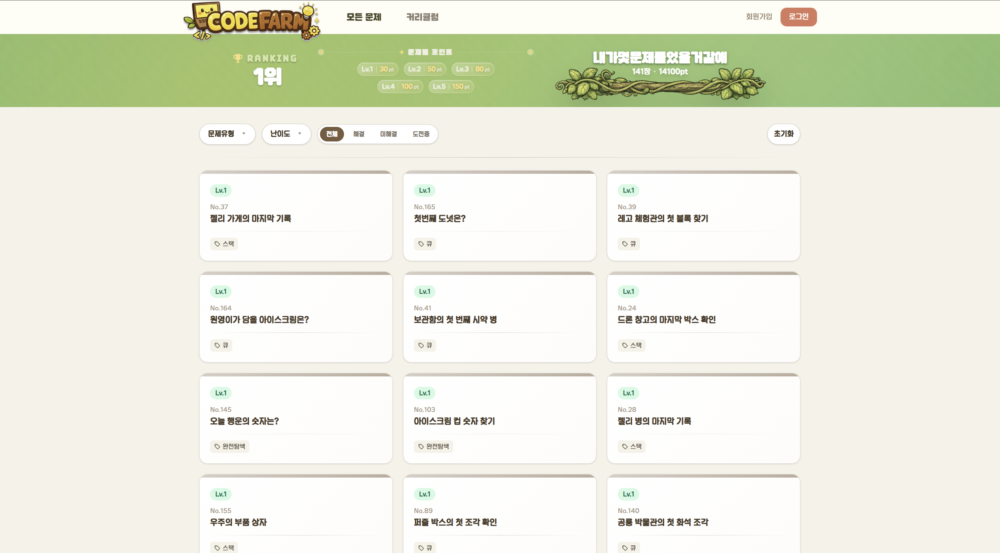

  
  <h3>내 곁에 따듯한 코딩 선생님, 코드팜</h3>
  <h4>학생들을 위한 실시간 <b>AI 문제 풀이 코칭 서비스</b>입니다.</h4>

 

- **개발 기간** : 2026.01.06 ~ 2026.02.13 **(3주)**
- **플랫폼** : Web
- **개발 인원** : 6명
- **기관** : 삼성 청년 SW · AI 아카데미 14기

 

  

---

## 🔎 목차
- [🙌 팀원 구성](#-팀원-구성)
- [🪄 기술 스택](#-기술-스택)

---

## 🙌 팀원 구성

> ✅ GitLab에선 README 내부 CSS가 잘 안 먹어서, 이미지 배치는 ``로 처리하는 게 가장 안정적입니다.

<table align="center">
  <tr>
    <td align="center">
      
       
      <ul>
        <li>... 구현</li>
        <li>... 구현</li>
      </ul>
    </td>
    <td align="center">
      
       
      <ul>
        <li>... 구현</li>
        <li>... 구현</li>
      </ul>
    </td>
    <td align="center">
      
       
      <ul>
        <li>... 구현</li>
        <li>... 구현</li>
      </ul>
    </td>
  </tr>

  <tr>
    <td align="center">
      
       
      <ul>
        <li>... 구현</li>
        <li>... 구현</li>
      </ul>
    </td>
    <td align="center">
      
       
      <ul>
        <li>... 구현</li>
        <li>... 구현</li>
      </ul>
    </td>
    <td align="center">
      
       
      <ul>
        <li>... 구현</li>
        <li>... 구현</li>
      </ul>
    </td>
  </tr>
</table>

---

## 🪄 기술 스택

### 🫡 Frontend

### 🤓 Backend

### 🧐 AI / Data

### 🥱 DevOps

